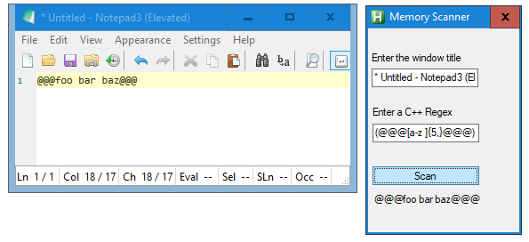

# AutoHotKey Memory Scanner

Use a regex to find a string in an application's memory.



# Compiling the DLL

```
$ g++ -shared main.cpp -o scan.dll
```

`scan.ahk` must be run as an administrator.  Otherwise you will get an error message.

It also requires AutoHotKey to be installed on your system already.